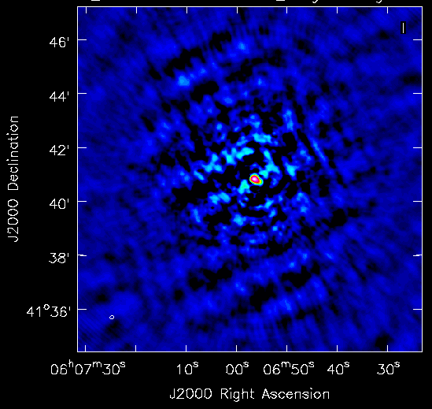
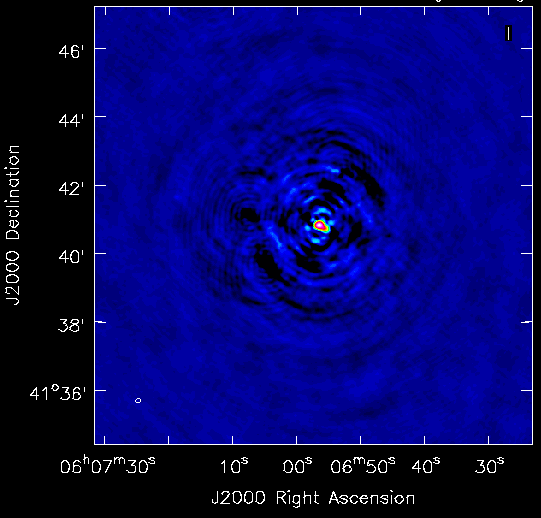
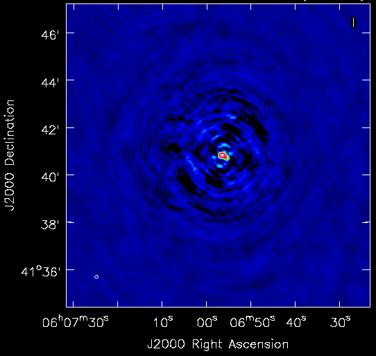
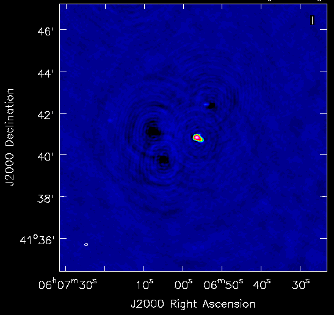

.. _facet_selfcal:

Facet Self-Calibration Operation
================================

This operation performs self calibration on the facet calibrator. The pipeline parset for this operation is ``facetselfcal_pipeline.parset``.

.. note::

    There should be one pipeline per facet, and the pipelines may be run in parallel.

    This operation is separated from the add (:ref:`add_facet_sources`) and subtract (:ref:`subtract_facet_sources`) operations as those pipelines
    must be run in series.


Data preparation
----------------

Input
	MS files from the :ref:`facet_add` operation with phase-shifted facet calibrator in the
	``DATA`` column and the dir-independent parmdbs.

Output
    Datasets ready for self calibration.

Pipeline Steps
    apply_dir_indep
        Apply dir-independent solutions to the phase-shifted ``DATA`` column to make a ``CORRECTED_DATA`` column for imaging.

    average_data, average_corr
        Average ``DATA`` and ``CORRECTED_DATA`` columns to 1 channel per band.

    create_compressed_mapfile_data, create_compressed_mapfile_corr
        Create datamaps suitable for DPPP concatenation.

    concat_data, concat_corr
        Run DPPP to concatenate all bands together.

    copy_column
        Copy the ``CORRECTED_DATA`` column so that a single MS file has all needed columns.

Test data
    With ``Test_run/results/facetadd/facet_patch_***/NEP_SB070-079.2ch10s.shift_cal``, this step produces the MS file ``Test_run/results/facetselfcal/facet_patch_***/NEP_SB070-079.2ch10s.concat_data`` with averaged, concatenated (in frequency) ``DATA`` and ``CORRECTED_DATA`` columns.


.. _selfcal_cycle:

Self-calibration cycle
----------------------
The general self-calibration cycle is described here. Modifications to this cycle
are described in later steps.

Input
	Concatenated, averaged MS file with ``DATA`` and ``CORRECTED_DATA`` columns.

Output
    Improved ``MODEL_DATA`` column and dir-dependent solutions.

Pipeline Steps
    averageX, create_compressed_mapfileX, concatX
        Average and concatenate in time in preparation for imaging.

    casa_imageX1, adjust_casa_mapfileX, maskX, casa_imageX2
        CASA imaging run. Imaging is done with a cell size of 1.5". Wide-band imaging is done if more than 5 bands are used. Multi-scale clean is always used.

    create_modelX_map, casa_ftX
        CASA FT run.

    solveX
        Solve for phases or amplitudes.


Self-calibration cycle 0
------------------------
The self-calibration cycle (see :ref:`selfcal_cycle`) is performed with phase-only calibration. The resulting image should be similar to the dir-independent images obtained in the :ref:`initial_subtract_operation` (although of higher resolution). An example image is shown in the `Cycle 0 example image`_.

.. _`Cycle 0 example image`:



   Cycle 0 example image


Self-calibration cycle 1
------------------------
The self-calibration cycle (see :ref:`selfcal_cycle`) is performed with phase-only calibration. The resulting image should show marked improvement over the cycle-0 image. An example image is shown in the `Cycle 1 example image`_.

.. _`Cycle 1 example image`:



   Cycle 1 example image


Self-calibration cycle 2
------------------------
The self-calibration cycle (see :ref:`selfcal_cycle`) is performed with phase-only calibration. The resulting image may or may not show improvement over the cycle-1 image. An example image is shown in the `Cycle 2 example image`_.

.. _`Cycle 2 example image`:



   Cycle 2 example image


Self-calibration cycle 3
------------------------
The self-calibration cycle (see :ref:`selfcal_cycle`) is performed with phase and amplitude calibration (fast phase, slow amplitude). The resulting image should show marked improvement over the cycle-2 image. An example image is shown in the `Cycle 3 example image`_.

.. note::

    Negative features in the image are due to poorly subtracted sources from the :ref:`initial_subtract_operation`.

.. _`Cycle 3 example image`:



   Cycle 3 example image


Smooth amplitudes 1
-------------------
The slow amplitude solutions from cycle 3 are smoothed to remove outliers.


Self-calibration cycle 4
------------------------
The self-calibration cycle (see :ref:`selfcal_cycle`) is performed with phase and amplitude calibration (fast phase, slow amplitude). The resulting image may or may not show improvement over the cycle-3 image. An example image is shown in the `Cycle 4 example image`_.

.. _`Cycle 4 example image`:

.. figure:: cycle_4_image.png
   :scale: 40 %
   :figwidth: 75 %
   :align: center
   :alt: example image

   Cycle 4 example image


Smooth amplitudes 2
-------------------
The slow amplitude solutions from cycle 4 are smoothed to remove outliers.


Merge self-calibration parmdbs and apply solutions
--------------------------------------------------

Input
	Fast phase and slow amplitude solution parmdbs and full-resolution datasets (with all facet sources).

Output
    Merged parmdb with both fast phase and slow amplitude solutions and datasets
    (with all facet sources) ready to image.

Pipeline Steps
    merge_selfcal_parmdbs
        Merge the dir-dependent solutions into one parmdb so that they can be applied in a single pass. An example of the solutions for RS106 is shown in `Merged parmdb fast solutions plot`_ and `Merged parmdb slow solutions plot`_.

    .. _`Merged parmdb fast solutions plot`:

    .. figure:: merged_parmdb_fast_plot.png
       :scale: 80 %
       :figwidth: 75 %
       :align: center
       :alt: example solutions

       Merged parmdb fast phase (CommonScalarPhase + TEC) solutions plot for RS106

    .. _`Merged parmdb slow solutions plot`:

    .. figure:: merged_parmdb_slow_plot.png
       :scale: 80 %
       :figwidth: 75 %
       :align: center
       :alt: example solutions

       Merged parmdb slow phase and amplitude solutions plot for RS106

    expand_merged_parmdb_map
        Match the number of dir-dependent parmdb entries in the datamap to that in the phase-shifted (with all facet sources) datasets datamap.

    apply_dir_dep
        Apply the dir-dependent solutions.


Test data
    With ``Test_run/results/facetselfcal/facet_patch_***/NEP_SB260_269.2ch10s_chunk29.merge_phase_parmdbs`` and ``Test_run/results/facetselfcal/facet_patch_***/NEP_SB260_269.2ch10s.smooth_amp2`` parmdbs, this step produces the merged parmdb ``Test_run/results/facetselfcal/facet_patch_***/```.


Make image of entire facet
--------------------------

Input
	Full-resolution datasets (with all facet sources) with dir-dependent solutions applied.

Output
    Image of the entire facet. An example image is shown in the `Facet example image`_.

    .. note::

        The image should fully enclose the facet boundaries. Areas outside of the facet are not cleaned (and have all sources subtracted).

    .. _`Facet example image`:

    .. figure:: facet_image.png
       :scale: 80 %
       :figwidth: 75 %
       :align: center
       :alt: example image

       Facet example image

Pipeline Steps
    average5, create_compressed_mapfile5, concat_averaged
        Average in time and frequency and concatenate in frequency in preparation for imaging.

    premask, wsclean1, create_imagebase_map, adjust_wsclean_mapfile1, copy_beam_info, mask5, wsclean2
        WSClean imaging run. Imaging is done with a cell size of 1.5". Wide-band imaging is done if more than 5 bands are used. Multi-scale clean is not used, as WSClean does not currently support clean masks for this mode.

Test data
    TODO


Subtract model
--------------

Input
	Model image of entire facet.

Output
    ``SUBTRACTED_DATA`` column for each band with all high-res sources subtracted.

Pipeline Steps
    create_model4_map, adjust_wsclean_mapfile2, create_compressed_mapfile6
        Make datamap for model images.

    concat_unaveraged
        Concatenate in frequency in preparation for FT.

    wsclean_ft
        Call WSClean to FT model image into ``MODEL_DATA`` column of each band.

    subtract
        Call BBS to subtract ``MODEL_DATA`` column from ``DATA`` column.

Test data
    TODO


Make low-res images of subtracted data
--------------------------------------

Input
	Full-resolution datasets (with all facet sources subtracted).

Output
    For each band, wide-field (~ 8 degree radius) images, one from before self calibration and one from after self calibration, are made at approximately 90" resolution. A region of an example image is shown in the `Residual example image`_. Note the improved subtraction for the circled source in the center (the facet calibrator).

    .. _`Residual example image`:

    .. figure:: residual_image.png
       :scale: 80 %
       :figwidth: 75 %
       :align: center
       :alt: example image

       Residual example image. The left image shows the residuals before self calibration; the right image shows the residuals after self calibration.

Pipeline Steps
    apply_dir_indep_pre, apply_dir_indep_post
        Apply dir-independent solutions in preparation for imaging.

    average_pre, average_post
        Average heavily in time and frequency in preparation for imaging.

    wsclean_pre, wsclean_post
        WSClean imaging run. Imaging is done with a cell size of 30".

Test data
    TODO


Verify self calibration
-----------------------

Input
	Low-resolution wide-field images of subtracted datasets.

Output
    For each band, a datamap with True (if selfcal succeeded) or False (if selfcal failed).

Pipeline Steps
    verify_subtract
        Verifies that no large residuals were introduced between the pre- and post-selfcal images. The verification returns False if the peak residual after selfcal is > 0.75 Jy or is > 1.1 * the peak residual before selfcal.

Test data
    TODO


