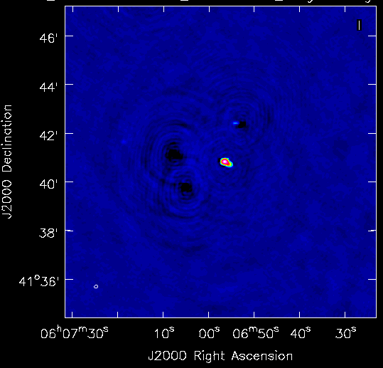

.. _facet_selfcal:

Facet Self-Calibration Operation
================================

This section describes the self-calibration operation of Factor, denoted
``facetselfcal`` (see the flowchart in Figure :num:`factor-flowchart`).

This operation performs self calibration on the facet calibrator. The pipeline parset for this operation is ``facetselfcal_pipeline.parset``.

.. note::

    There should be one pipeline per facet, and the pipelines may be run in parallel.

    This operation is separated from the subtract (:ref:`subtract_facet_sources`) operation as those pipelines
    must be run in series.

Data preparation
----------------

Input
	MS files from the :ref:`initial_subtract_operation` with
	``SUBTRACTED_DATA_ALL`` (or ``SUBTRACTED_DATA_ALL_NEW`` if at least one facet has gone through self calibration previously) and ``CORRECTED_DATA`` columns, their dir-independent parmdbs, and the merged sky models in ``makesourcedb`` format.

Output
    Datasets ready for self calibration.

Pipeline Steps
    create_ms_map, create_parmdb_map, create_full_skymodels_map
        Make datamaps for input MS files, their dir-independent parmdbs, and
        the merged sky models.

    make_facet_skymodels_all, make_facet_skymodels_cal
        Select all model components belonging to the facet calibrator and to all facet sources and writes
        these sky models in ``makesourcedb`` format.

    shift_empty
        Run DPPP to split and phase shift ``SUBTRACTED_DATA_ALL`` column (or ``SUBTRACTED_DATA_ALL_NEW`` column if at least one facet has gone through self calibration previously) to the RA and Dec of the facet.

    add_all_facet_sources, add_cal_facet_sources
        Run BBS to add sources to the data using the sky models above. The ``FACET_DATA_CAL`` column contains the calibrator only, and the ``FACET_DATA_ALL`` column contains all facet sources.

    average_data
        Average ``FACET_DATA_CAL`` column to 1 channel per band.

    apply_dir_indep
        Apply dir-independent solutions to the phase-shifted ``DATA`` column to make a ``CORRECTED_DATA`` column for imaging.

    create_compressed_mapfile_data
        Create datamap suitable for DPPP concatenation.

    concat_data, concat_corr
        Run DPPP to concatenate all bands together.

    copy_column
        Copy the ``CORRECTED_DATA`` column so that a single MS file has all needed columns.

    make_chunks, create_chunks_map
        Split the data in time to parallelize the calibration.

    add_imaging_cols
        Add CASA imaging columns to the split datasets.

    create_chunks_compressed_mapfile, concat_chunks
        Concatenate the time chunks (for later use with ft steps).

Test data
    With ``Test_data/RX42_SB070-079.2ch10s.ms``, this step produces the sky models ``NEP_SB070-079.2ch10s.wsclean_low2-model.make_facet_skymodels_all`` and ``NEP_SB070-079.2ch10s.wsclean_low2-model.make_facet_skymodels_cal`` and the MS file ``RX42_SB070-079.2ch10s_chunk**.concat_chunks`` in ``Test_run/results/facetadd/facet_patch_543/`` with averaged, concatenated (in frequency) ``DATA`` and ``CORRECTED_DATA`` columns.

.. _selfcal_cycle:

Self-calibration cycle
----------------------
The general self-calibration cycle is described here. Modifications to this cycle
are described in later steps. The cycle number is denoted here with an "X" in the pipeline step names.

Input
	Concatenated, averaged MS file with ``DATA`` and ``CORRECTED_DATA`` columns.

Output
    Improved ``MODEL_DATA`` column and dir-dependent solutions.

Pipeline Steps
    averageX, create_compressed_mapfileX, concatX
        Average and concatenate in time in preparation for imaging.

    casa_imageX1, adjust_casa_mapfileX, maskX, casa_imageX2
        CASA imaging run. Imaging is done with a cell size of 1.5". Wide-band imaging is done if more than 5 bands are used. Multi-scale clean is always used.

    create_modelX_map, casa_ftX
        CASA FT run.

    solveX
        Solve for phases or amplitudes.

Test data
    In each cycle, this step takes the MS file ``NEP_SB070-079.2ch10s.concat_data`` (or the equivalent MS file that results from virtual concatenation of the time-chunked MS files, such as ``NEP_SB070-079.2ch10s_chunk29.concat1``), averages to get the MS file ``NEP_SB070-079.2ch10s.averageX``, and makes the model image ``NEP_SB070-079.2ch10s_chunk29.casa_imageX2.model`` (``NEP_SB070-079.2ch10s_chunk29.casa_imageX2.model.tt0/tt1`` if wide-band clean is used). All of these files are in ``Test_run/results/facetselfcal/facet_patch_543/``.

Self-calibration cycle 0
------------------------
The self-calibration cycle (see :ref:`selfcal_cycle`) is performed with phase-only calibration. The resulting image should be similar to the dir-independent images obtained in the :ref:`initial_subtract_operation` (although of higher resolution). An example image is shown in Figure :num:`cycle-0-example-image`.

.. _cycle-0-example-image:

.. figure:: cycle_0_image.png
   :scale: 40 %
   :figwidth: 75 %
   :align: center
   :alt: example image

   Cycle 0 example image

Self-calibration cycle 1
------------------------
The self-calibration cycle (see :ref:`selfcal_cycle`) is performed with phase-only calibration. The resulting image should show marked improvement over the cycle-0 image. An example image is shown in Figure :num:`cycle-1-example-image`.

.. _cycle-1-example-image:

.. figure:: cycle_1_image.png
   :scale: 40 %
   :figwidth: 75 %
   :align: center
   :alt: example image

   Cycle 1 example image

Self-calibration cycle 2
------------------------
The self-calibration cycle (see :ref:`selfcal_cycle`) is performed with phase-only calibration. The resulting image may or may not show improvement over the cycle-1 image. An example image is shown in Figure :num:`cycle-2-example-image`.

.. _cycle-2-example-image:

.. figure:: cycle_2_image.png
   :scale: 40 %
   :figwidth: 75 %
   :align: center
   :alt: example image

   Cycle 2 example image

Self-calibration cycle 3
------------------------
The self-calibration cycle (see :ref:`selfcal_cycle`) is performed with phase and amplitude calibration (fast phase, slow amplitude). The resulting image should show marked improvement over the cycle-2 image. An example image is shown in Figure :num:`cycle-3-example-image`.

.. note::

    Negative features in the image are due to poorly subtracted sources from the :ref:`initial_subtract_operation`.

.. _cycle-3-example-image:

.. figure:: cycle_3_image.png
   :scale: 40 %
   :figwidth: 75 %
   :align: center
   :alt: example image

   Cycle 3 example image

Smooth amplitudes 1
-------------------
The slow amplitude solutions from cycle 3 are smoothed to remove outliers.

Test data
    With the parmdb ``NEP_SB070-079.2ch10s_chunk29.merge_amp_parmdbs1`` in ``Test_run/results/facetselfcal/facet_patch_543/``, this step produces the smoothed parmdb ``NEP_SB070-079.2ch10s.smooth_amp1``.

Self-calibration cycle 4
------------------------
The self-calibration cycle (see :ref:`selfcal_cycle`) is performed with phase and amplitude calibration (fast phase, slow amplitude). The resulting image may or may not show improvement over the cycle-3 image. An example image is shown in Figure :num:`cycle-4-example-image`.

.. _cycle-4-example-image:

   Cycle 4 example image

Smooth amplitudes 2
-------------------
The slow amplitude solutions from cycle 4 are smoothed to remove outliers.

Test data
    With the parmdb ``NEP_SB070-079.2ch10s_chunk29.merge_amp_parmdbs1`` in ``Test_run/results/facetselfcal/facet_patch_543/``, this step produces the smoothed parmdb ``NEP_SB070-079.2ch10s.smooth_amp1``.

Merge self-calibration parmdbs and apply solutions
--------------------------------------------------

Input
	Fast phase and slow amplitude solution parmdbs and full-resolution datasets (with all facet sources).

Output
    Merged parmdb with both fast phase and slow amplitude solutions and datasets
    (with all facet sources) ready to image.

Pipeline Steps
    merge_selfcal_parmdbs
        Merge the dir-dependent solutions into one parmdb so that they can be applied in a single pass. An example of the solutions for RS106 is shown in Figures :num:`merged-parmdb-fast-solutions-plot` and :num:`merged-parmdb-slow-solutions-plot`.

    .. _merged-parmdb-fast-solutions-plot:

    .. figure:: merged_parmdb_fast_plot.png
       :scale: 80 %
       :figwidth: 75 %
       :align: center
       :alt: example solutions

       Merged parmdb fast phase (CommonScalarPhase + TEC) solutions plot for RS106

    .. _merged-parmdb-slow-solutions-plot:

    .. figure:: merged_parmdb_slow_plot.png
       :scale: 80 %
       :figwidth: 75 %
       :align: center
       :alt: example solutions

       Merged parmdb slow phase and amplitude solutions plot for RS106

    expand_merged_parmdb_map
        Match the number of dir-dependent parmdb entries in the datamap to that in the phase-shifted (with all facet sources) datasets datamap.

    apply_dir_dep
        Apply the dir-dependent solutions.

Test data
    With ``NEP_SB070-079.2ch10s_chunk29.merge_phase_parmdbs`` and ``NEP_SB070-079.2ch10s.smooth_amp2`` parmdbs, this step produces the merged parmdb ``NEP_SB070-079.2ch10s_chunk29.merge_selfcal_parmdbs``, all of which are in ``Test_run/results/facetselfcal/facet_patch_543/``.

Make image of entire facet
--------------------------

Input
	Full-resolution datasets (with all facet sources) with dir-dependent solutions applied.

Output
    Image of the entire facet. An example image is shown in Figure :num:`facet-example-image`.

    .. note::

        The image should fully enclose the facet boundaries. Areas outside of the facet are not cleaned (and have all sources subtracted).

    .. _facet-example-image:

    .. figure:: facet_image.png
       :scale: 80 %
       :figwidth: 75 %
       :align: center
       :alt: example image

       Facet example image

Pipeline Steps
    average5, create_compressed_mapfile5, concat_averaged
        Average in time and frequency and concatenate in frequency in preparation for imaging.

    premask, wsclean1, create_imagebase_map, adjust_wsclean_mapfile1, copy_beam_info, mask5, wsclean2
        WSClean imaging run. Imaging is done with a cell size of 1.5". Wide-band imaging is done if more than 5 bands are used. Multi-scale clean is not used, as WSClean does not currently support clean masks for this mode.

Test data
    With the phase-shifted facet all-source MS files (e.g., ``NEP_SB070-079.2ch10s.shift_all``), this step produces the averaged, virtually-concatenated MS file ``RX42_SB070-079.2ch10s.concat_averaged``, which is used to make the image ``NEP_SB070-079.2ch10s.wsclean2-image.fits`` (or ``NEP_SB070-079.2ch10s.wsclean2-MFS-image.fits`` if wide-band clean was used). All of these files are in ``Test_run/results/facetselfcal/facet_patch_543/``.

Subtract model
--------------

Input
	Model image of entire facet.

Output
    ``SUBTRACTED_DATA`` column for each band with all high-res sources subtracted.

Pipeline Steps
    create_model4_map, adjust_wsclean_mapfile2, create_compressed_mapfile6
        Make datamap for model images.

    concat_unaveraged
        Concatenate in frequency in preparation for FT.

    wsclean_ft
        Call WSClean to FT model image into ``MODEL_DATA`` column of each band.

    subtract
        Call BBS to subtract ``MODEL_DATA`` column from ``DATA`` column.

Test data
    With the phase-shifted facet all-source MS files (e.g., ``NEP_SB070-079.2ch10s.shift_all``), this step produces the unaveraged, virtually-concatenated MS file ``RX42_SB070-079.2ch10s.concat_unaveraged``, which receives the ``MODEL_DATA`` column (from the wsclean_ft call) and the ``SUBTRACTED_DATA`` column (from the subtract call).  All of these files are in ``Test_run/results/facetselfcal/facet_patch_543/``.

Make low-res images of subtracted data
--------------------------------------

Input
	Full-resolution datasets (with all facet sources subtracted).

Output
    For each band, wide-field (~ 8 degree radius) images, one from before self calibration and one from after self calibration, are made at approximately 90" resolution. A region of an example image is shown in Figure :num:`residual-example-image`. Note the improved subtraction for the circled source in the center (the facet calibrator). The negative holes in the image are due to the poor initial subtraction done with the direction-independent instrument tables.

    .. _residual-example-image:

    .. figure:: residual_image.png
       :scale: 80 %
       :figwidth: 75 %
       :align: center
       :alt: example image

       Residual example image. The left image shows the residuals before self calibration; the right image shows the residuals after self calibration.

Pipeline Steps
    apply_dir_indep_pre, apply_dir_indep_post
        Apply dir-independent solutions in preparation for imaging.

    average_pre, average_post
        Average heavily in time and frequency in preparation for imaging.

    wsclean_pre, wsclean_post
        WSClean imaging run. Imaging is done with a cell size of 30".

Test data
    With the phase-shifted facet all-source MS files (e.g., ``NEP_SB070-079.2ch10s.shift_all``), this step produces averaged MS files for each band (e.g., ``RX42_SB070-079.2ch10s.average_pre`` and ``RX42_SB070-079.2ch10s.average_post``), which in turn are used to make images of each band (e.g., ``RX42_SB070-079.2ch10s.wsclean_pre-image.fits`` and ``RX42_SB070-079.2ch10s.wsclean_post-image.fits``).  All of these files are in ``Test_run/results/facetselfcal/facet_patch_543/``.

Verify self calibration
-----------------------

Input
	Low-resolution wide-field images of subtracted datasets.

Output
    For each band, a datamap with True (if selfcal succeeded) or False (if selfcal failed).

Pipeline Steps
    verify_subtract
        Verifies that no large residuals were introduced between the pre- and post-selfcal images. The verification returns False if the peak residual after selfcal is > 0.75 Jy or is > 1.1 * the peak residual before selfcal.

Test data
    With the images for each band made in the previous step (e.g., ``RX42_SB070-079.2ch10s.wsclean_pre-image.fits`` and ``RX42_SB070-079.2ch10s.wsclean_post-image.fits``), this step produces the ``break.mapfile``, ``maxvalpre.mapfile``, and ``maxvalpost.mapfile`` files in ``Test_run/results/facetselfcal/facet_patch_543/mapfiles/``.

